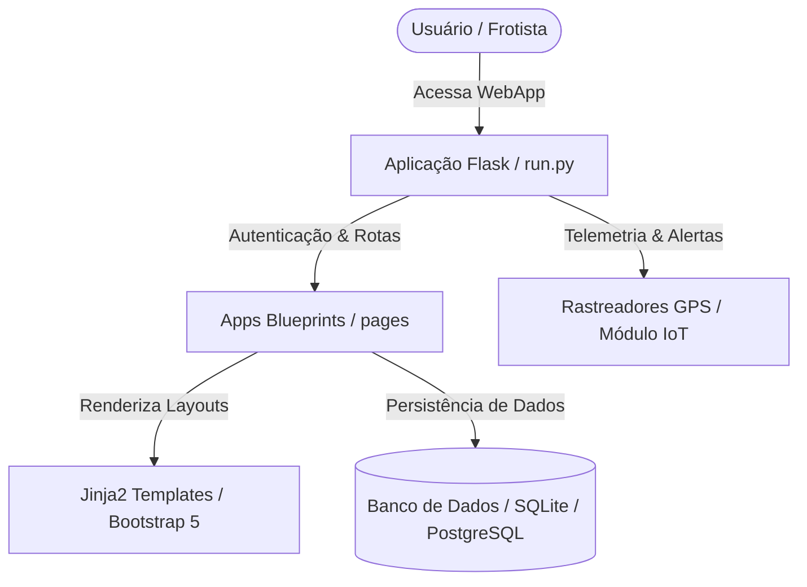
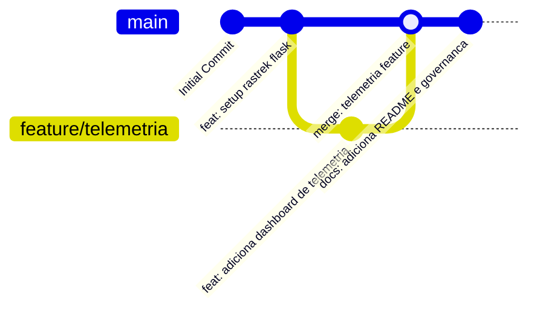

# 🚗 Rastrek - Rastreamento Veicular, Telemetria & Gestão de Frotas


> **Rastrek - Líder em Rastreamento Veicular no Brasil desde 2012.**  
> Plataforma web desenvolvida em Flask para monitoramento de veículos em tempo real, telemetria, bloqueio emergencial, controle de manutenção e otimização logística de frotas.

---

## 📌 Visão Geral

Atuando na área de segurança veicular desde 2012, a **Rastrek** evoluiu continuamente junto com as tecnologias do setor. A plataforma oferece:

- **Telemetria & Rastreamento em Tempo Real**: Localização exata de veículos, velocidade, ignição e histórico de rotas.
- **Gestão de Frotas & Logística**: Controle de odômetro, consumo de combustível, rotas otimizadas e fiscalização de atribuições.
- **Segurança & Bloqueio Veicular**: Acionamento remoto de bloqueadores, cercas virtuais e alertas de pânico.
- **Manutenção Preventiva**: Agendamento de revisões e alertas de desgaste de componentes.

---

## 📐 Fluxo da Aplicação & Arquitetura (Mermaid)



---

## 📊 Fluxo de Branches (Git Graph)



---

## 📁 Estrutura Oficial do Repositório

```text
Rastreck/
├── README.md                          # Painel principal com visão geral, arquitetura e instruções
├── run.py                             # Ponto de entrada do servidor de desenvolvimento Flask
├── build.sh                           # Script de compilação e preparação do ambiente
├── gunicorn-cfg.py                    # Configuração para produção com servidor WSGI Gunicorn
├── requirements.txt                   # Dependências Python (Flask, SQLAlchemy, Jinja2, etc.)
├── apps/                              # Aplicação principal (Blueprints, Models, Views)
│   ├── config.py                      # Configurações de ambiente (Debug, Production, DB)
│   ├── pages/                         # Rotas e controladores das páginas
│   ├── static/                        # Ativos estáticos (CSS, JS, imagens, fornecedores)
│   └── templates/                     # Páginas HTML Jinja2 (layouts, partials e telas)
└── docs/                              # Governança, infraestrutura e sustentação
    ├── diretrizes_documentacao.md     # Normas editoriais, Git Graph e registros ADR
    ├── estrategia_execucao.md         # Estratégia Git, fluxo de branches e contribuição
    ├── migration_guide.md             # Guia de clonagem e onboarding em novas máquinas
    ├── ajuda_infra.md                 # Arquitetura, estrutura e comandos rápidos
    ├── postmortem.md                  # Registro incremental de incidentes
    ├── troubleshooting.md             # Solução de problemas comuns
    ├── politica_backup.md             # Política de backup 3-2-1 e sincronização
    ├── plano_personalizacao.md        # Roteiro de expansão de novas categorias
    └── prompt_ia.md                   # Contexto permanente para IA no repositório
```

---

## ⚡ Como Executar a Aplicação Localmente

### 1. Clonar o repositório
```bash
git clone git@github.com:fvier/rastreck.git
cd rastreck
```

### 2. Criar e ativar o ambiente virtual Python
```bash
python3 -m venv venv
source venv/bin/activate  # No Linux/Mac
# venv\Scripts\activate   # No Windows
```

### 3. Instalar as dependências
```bash
pip install -r requirements.txt
```

### 4. Executar a aplicação em modo de desenvolvimento
```bash
python3 run.py
```
Acesse a aplicação no navegador em `http://127.0.0.1:5000`.

## Banco de dados e produção

O desenvolvimento local pode usar SQLite com `DEBUG=True`. Em produção,
`DATABASE_URL` é obrigatória e deve apontar para PostgreSQL. O esquema é
controlado por Flask-Migrate:

```bash
flask db upgrade
```

Consulte [Deploy com PostgreSQL](docs/deploy_postgresql.md) para a primeira
publicação e para a transferência segura dos dados atuais.

---

## 📖 Documentação & Governança

- [Diretrizes de Documentação](file:///home/vier/Documentos/Code/Rastreck/docs/diretrizes_documentacao.md)
- [Estratégia de Execução & Git](file:///home/vier/Documentos/Code/Rastreck/docs/estrategia_execucao.md)
- [Guia de Migração & Onboarding](file:///home/vier/Documentos/Code/Rastreck/docs/migration_guide.md)
- [Ajuda & Infraestrutura](file:///home/vier/Documentos/Code/Rastreck/docs/ajuda_infra.md)
- [Troubleshooting & Diagnóstico](file:///home/vier/Documentos/Code/Rastreck/docs/troubleshooting.md)
- [Postmortem & Incidentes](file:///home/vier/Documentos/Code/Rastreck/docs/postmortem.md)
- [Política de Backup](file:///home/vier/Documentos/Code/Rastreck/docs/politica_backup.md)
- [Plano de Personalização](file:///home/vier/Documentos/Code/Rastreck/docs/plano_personalizacao.md)

---

&copy; **Rastrek** - Todos os direitos reservados.
